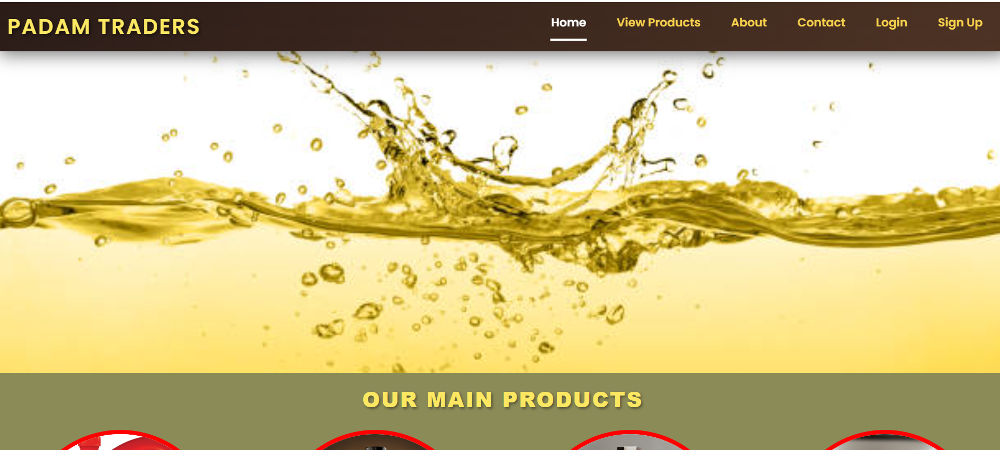
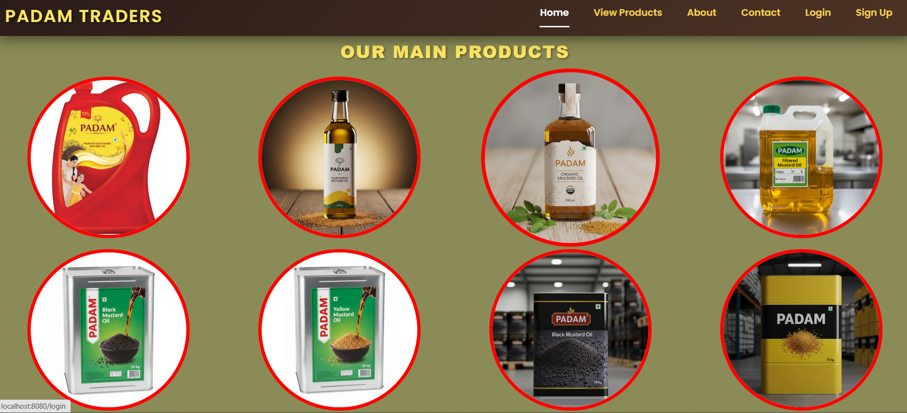
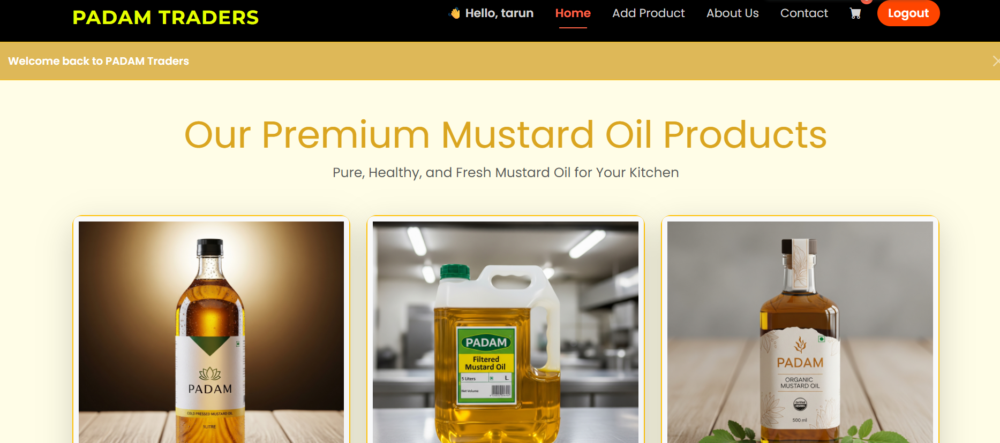
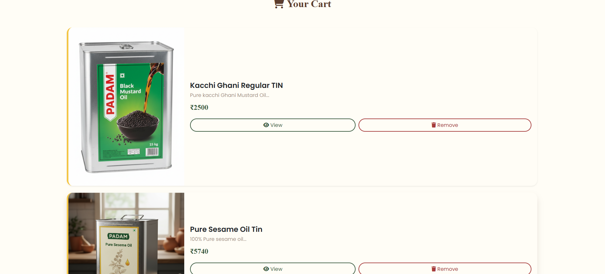
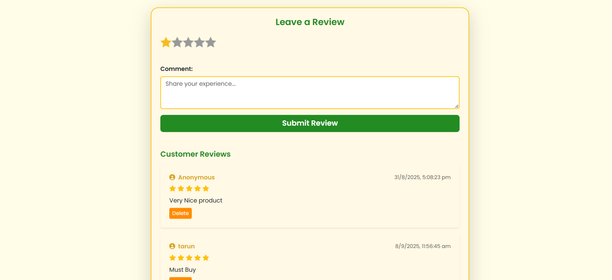
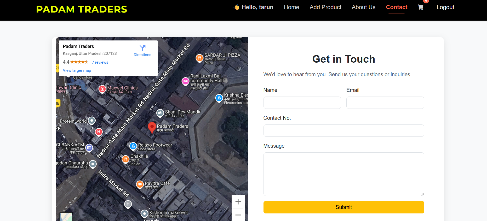
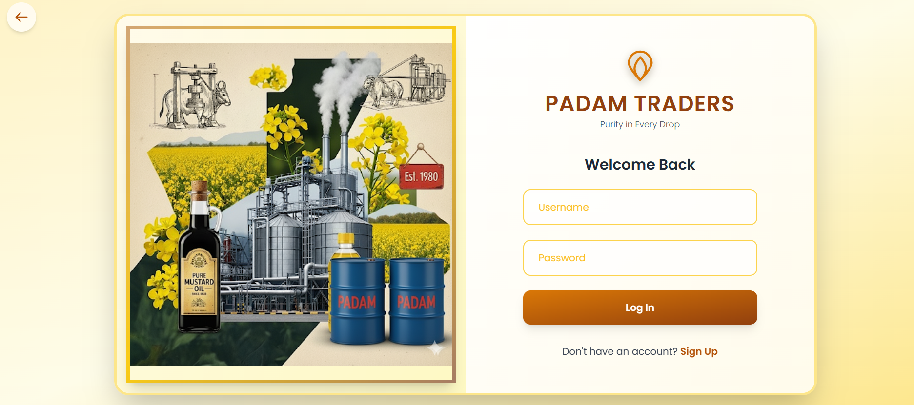

# 🌿 Padam Traders – E-Commerce Website

Welcome to **Padam Traders**, a modern **e-commerce web application** designed with a clean and natural theme inspired by **mustard oil branding**.  
The website provides customers with a smooth shopping journey while also offering an **admin dashboard** for product management.

---

## ✨ Key Features

### 👤 Authentication
- Secure **login & signup** using **express-session**
- Passwords stored securely
- Different user roles (Admin / Customer)

### 🛍️ Shopping Experience
- **Product Browsing** – View all products with details and images  
- **Cart System** – Add/remove items, automatic total calculation  
- **Wishlist** – Save favorite items for later  

### 🛒 Admin & User Architecture
- **Admin**:  
  - Add, edit, delete products  
  - Manage users & orders  
- **User**:  
  - Browse, wishlist, and add products to cart  
  - Checkout and contact support  

### ✅ Server-Side Validations
- Ensures only clean and correct data is stored  
- Protects against invalid inputs  

### 📞 Contact Page
- Simple **Contact Us** form for queries  
- Sends messages directly to the system  

### 🎨 Branding & Design
- **Mustard Yellow + Earthy Green** theme  
- **Bootstrap styling** with hover animations  
- Fully **responsive** for mobile and desktop  

---

## 📸 Screenshots

### 🏠 Homepage

### 🛍️ Products Page

### Home

### 🛒 Cart & Wishlist

### Reviews

### 💳 Checkout

### 🔑 Authentication (Login/Signup)

👉 Just replace the placeholder `.png` files inside a `/screenshots` folder with your own actual captures.

---

## 📂 Project Highlights

- **Frontend**: EJS templates + Bootstrap 5  
- **Backend**: Node.js & Express.js  
- **Database**: MongoDB (Mongoose)  
- **Authentication**: express-session  
- **Flash Messages**: User feedback on actions  
- **Architecture**: MVC-like separation for clarity  

---

## 🚀 Why Padam Traders?

- Brings **mustard oil branding** into the digital world 🌿  
- Smooth shopping experience with **cart & wishlist**  
- **Admin dashboard** to keep products and users managed  
- Clean, modern, and **trust-inspiring design**  

